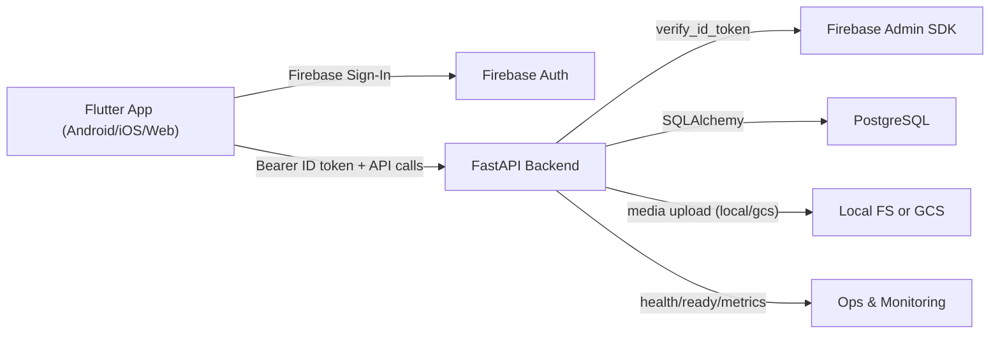

# College Application - Comprehensive Project Overview

## 1. Product Summary

This repository contains a full-stack college community application intended for mobile/web client distribution and production backend hosting.

- Backend: `FastAPI` service with PostgreSQL-targeted schema/migrations, Firebase token verification, profile/media APIs, and operational endpoints.
- Frontend: `Flutter` app using Firebase Auth, onboarding/profile setup flows, and event browsing UI.
- Deployment direction: backend containerized for Cloud Run; frontend prepared for Android/iOS/web distribution with environment-driven API endpoint.

---

## 2. Repository Structure

- Backend app: `app_backend/`
  - API entrypoint: `app_backend/src/main.py`
  - Core runtime: `app_backend/src/core/`
  - Routes: `app_backend/src/routes/`
  - Domain services: `app_backend/src/services/`
  - ORM entities: `app_backend/src/db/entities.py`
  - Schema migrations: `app_backend/alembic/`
  - Tests: `app_backend/tests/`
- Frontend app: `app_frontend_app/`
  - Flutter source: `app_frontend_app/lib/`
  - Platform folders: `android/`, `ios/`, `web/`, `windows/`, `macos/`, `linux/`
  - Tests: `app_frontend_app/test/`
- Operations and governance docs: `docs/`
- CI pipeline: `.github/workflows/ci.yml`
- Local compose scaffold: `docker-compose.yml`

---

## 3. Technology Stack

### Backend
- Python 3.12
- FastAPI + Uvicorn
- SQLAlchemy 2 + Alembic
- Pydantic v2 + pydantic-settings
- Firebase Admin SDK (JWT ID token verification)
- PostgreSQL driver support: `psycopg2-binary`, `asyncpg`
- Cloud integrations:
  - GCP Secret Manager (`google-cloud-secret-manager`)
  - GCS uploads (`google-cloud-storage`)

### Frontend
- Flutter / Dart
- Firebase Core + Firebase Auth + Google Sign-In
- HTTP client: `http`
- Device/media features: `image_picker`, `geolocator`, `geocoding`
- UI libs: `google_fonts`, `lottie`, `curved_navigation_bar`

### DevOps / Quality
- Docker multi-stage backend image with non-root runtime
- GitHub Actions CI for backend + frontend lint/test gates
- Health/readiness/metrics operational endpoints and runbook docs

---

## 4. High-Level Architecture

Key principle: authentication identity is delegated to Firebase; business/domain persistence is handled by backend database tables.

---

## 5. Backend Architecture and Logic

## 5.1 App Bootstrap and Middleware
- Entrypoint: `app_backend/src/main.py`
- App initialization:
  - loads settings (`get_settings`)
  - configures logging
  - registers middleware:
    - `RequestContextMiddleware` (request ID + timing logs)
    - `RateLimitMiddleware` (per-IP in-memory minute window)
    - `SecurityHeadersMiddleware`
  - includes route groups under `/api/v1` except system routes.
- Startup behavior:
  - `AUTO_CREATE_SCHEMA` optionally triggers `Base.metadata.create_all`.

## 5.2 Route Domains
- System (`/healthz`, `/readyz`, `/metrics`) in `app_backend/src/routes/system_routes.py`
- Clubs CRUD: `clubs_routes.py`
- Positions CRUD: `positions_routes.py`
- Events create/list: `events_routes.py`
- Users upsert/current: `users_routes.py`
- Profiles upsert/current: `profile_routes.py`
- Media upload: `media_routes.py`

Public vs protected pattern:
- Public reads: health/readiness and selected list/get routes (clubs/positions/events).
- Protected mutations and identity/profile/media routes use `Depends(verify_firebase_token)`.

## 5.3 Service Layer
- Route handlers are thin; business logic sits in `app_backend/src/services/*.py`.
- Services perform validation-through-models, persistence operations, and error mapping.
- Storage abstraction:
  - `storage_service.py` supports `local` and `gcs` providers with same upload contract.

## 5.4 Data Model
Defined in `app_backend/src/db/entities.py`:
- `users`: Firebase UID, email, source, active flag.
- `profiles`: user profile per Firebase UID.
- `clubs`
- `positions` (FK to `clubs.c_id`, cascade delete).
- `events`

Notable constraints:
- `clubs`: unique college+club name.
- `positions`: unique hierarchy per club (`c_id`, `hierarchy`).
- timezone-aware datetime columns (post hardening migration).

## 5.5 Database and Migrations
- Alembic env: `app_backend/alembic/env.py` resolves DB URL from settings.
- Revisions:
  - `0001_initial_schema.py` (initial schema)
  - `0002_postgres_hardening.py` (timezone-aware datetime alterations + index additions)
- Container startup currently runs `alembic upgrade head` before app process.

## 5.6 Security and Secrets
- Firebase token verification in `app_backend/src/core/security.py`.
- Config and secrets behavior in `app_backend/src/core/config.py` + `app_backend/src/core/secrets.py`:
  - `SECRETS_PROVIDER=env` (default) reads env vars directly.
  - `SECRETS_PROVIDER=gcp` fetches from Secret Manager for supported keys.
- Metrics endpoint can be gated via `PROTECT_METRICS` + `METRICS_TOKEN`.

---

## 6. Frontend Architecture and Logic

## 6.1 Bootstrap and App Shell
- Entry: `app_frontend_app/lib/main.dart`
- Initializes Firebase with generated options (`firebase_options.dart`).
- Root widget uses `AuthGate` to decide first screen.

## 6.2 Navigation and User Flow
- `AuthGate` (`pages/auth/auth_gate.dart`) decides:
  - not signed in -> login
  - signed in but unverified email/password account -> post-email login screen
  - signed in + profile exists -> bottom navigation shell
  - signed in + profile missing -> profile setup
- Main shell:
  - `Bottombar` with `HomeScreen` and `ChatScreen`
  - `ChatScreen` currently placeholder (not implemented chat backend).

## 6.3 Authentication and Backend Sync
- Implemented in `lib/services/auth_methods.dart`:
  - email/password signup + verification
  - email/password sign-in
  - Google sign-in
  - backend sync call to `/api/v1/users`
  - profile existence check via `/api/v1/profiles/me`

## 6.4 API Integration
- Base URL from compile-time define: `API_BASE_URL` in `lib/config/api_config.dart`.
- Core backend calls:
  - users sync, profile read/write, media upload, events fetch.
- Profile setup uses:
  - location capture
  - image picker and upload
  - profile upsert submission

---

## 7. Infrastructure, Deployment, and Runtime Model

## 7.1 Backend Container
- `app_backend/Dockerfile` is multi-stage and Cloud Run oriented:
  - non-root `appuser`
  - default `PORT=8080`
  - healthcheck on `/healthz`
  - `CMD` runs migrations then starts Uvicorn

## 7.2 Local Compose
- Root `docker-compose.yml` provides backend service scaffold.
- Current compose is local-dev oriented and may require port alignment review against `PORT=8080` container default if used without overrides.

## 7.3 Storage Runtime Modes
- `STORAGE_PROVIDER=local`: filesystem uploads and `/uploads` static mount.
- `STORAGE_PROVIDER=gcs`: uploads to GCS bucket, returns public URL.

## 7.4 Secrets Runtime Modes
- `SECRETS_PROVIDER=env`: direct env variables.
- `SECRETS_PROVIDER=gcp`: Secret Manager fetch path available.

---

## 8. CI/CD and Quality Gates

Workflow: `.github/workflows/ci.yml`

- Backend job:
  - dependency install
  - Ruff lint (`src`, `tests`)
  - migration smoke (`alembic upgrade head`)
  - pytest with coverage threshold
- Frontend job:
  - `flutter pub get`
  - format check
  - analyze
  - tests

Current test depth:
- Backend has focused API tests (`test_health_and_clubs.py`, `test_events.py`).
- Frontend has basic widget test (`widget_test.dart`), limited integration coverage.

---

## 9. Functional Coverage (Current)

Implemented:
- Auth onboarding (email/password + Google via Firebase)
- Backend user synchronization
- Profile setup with image upload and location capture
- Events list + create API
- Clubs and positions CRUD APIs
- Health/readiness/metrics endpoints
- Local/GCS storage provider abstraction for media uploads

Partial/placeholder:
- Chat feature screen exists but no functional messaging implementation
- Forgot-password flows marked TODO in UI

---

## 10. Production Readiness Assessment

## 10.1 Strengths
- Clear layered backend architecture and route/service separation
- Migrations in place, Postgres direction established
- Security primitives present (token verification, security headers, rate limiting)
- Cloud-ready Docker baseline with non-root runtime
- Documented runbook, security, and rollout checklists

## 10.2 Risks / Gaps Before App-Store + Cloud Production
- Chat is not implemented (placeholder UI only).
- Migration-at-startup strategy should be validated for concurrent instance rollout behavior.
- Compose/local config and container runtime port conventions should remain aligned to avoid env drift.
- Observability is basic in-process; production external telemetry integration needed.
- Frontend store readiness tasks (permissions/privacy text, signing/release pipelines) need completion and verification.
- Test coverage should be expanded for protected flows, storage provider behavior, and end-to-end onboarding.

## 10.3 Recommended Next Actions (Prioritized)
1. Finalize production environment contract (DB URL, secrets provider, storage provider) for Cloud Run.
2. Add release-grade integration tests for auth/profile/media critical path.
3. Build and validate staging soak checklist in `docs/release/production_rollout_checklist.md`.
4. Complete app-store release prerequisites (signing, privacy/permission declarations, release config).
5. Implement or scope out chat backend and secure messaging requirements before advertising chat capability.

---

## 11. Handover Notes for Senior Developer

- Source of truth for backend runtime is `app_backend/src/main.py` (not legacy root `main.py`).
- Authentication is Firebase-backed; backend enforces token verification on protected APIs.
- Deployment target should be treated as:
  - Backend: stateless FastAPI service + managed Postgres + managed object storage + managed secrets.
  - Frontend: environment-specific API define and Firebase project alignment per release channel.
- Existing docs in `docs/security`, `docs/operations`, and `docs/release` provide baseline operational policy and should be tied into your team’s final SRE/security standards.
